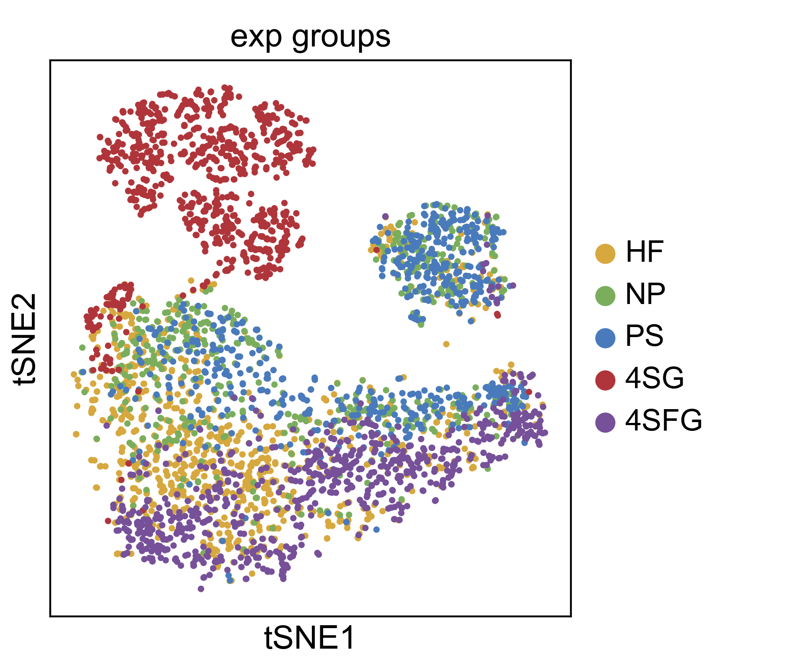
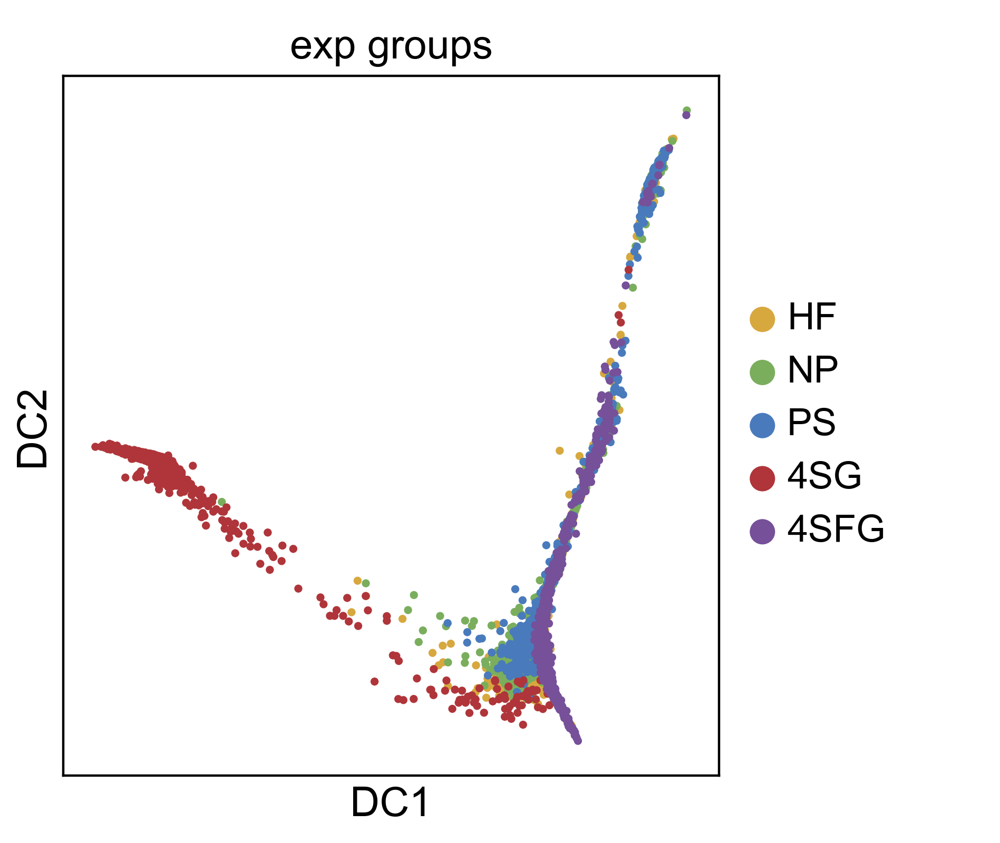
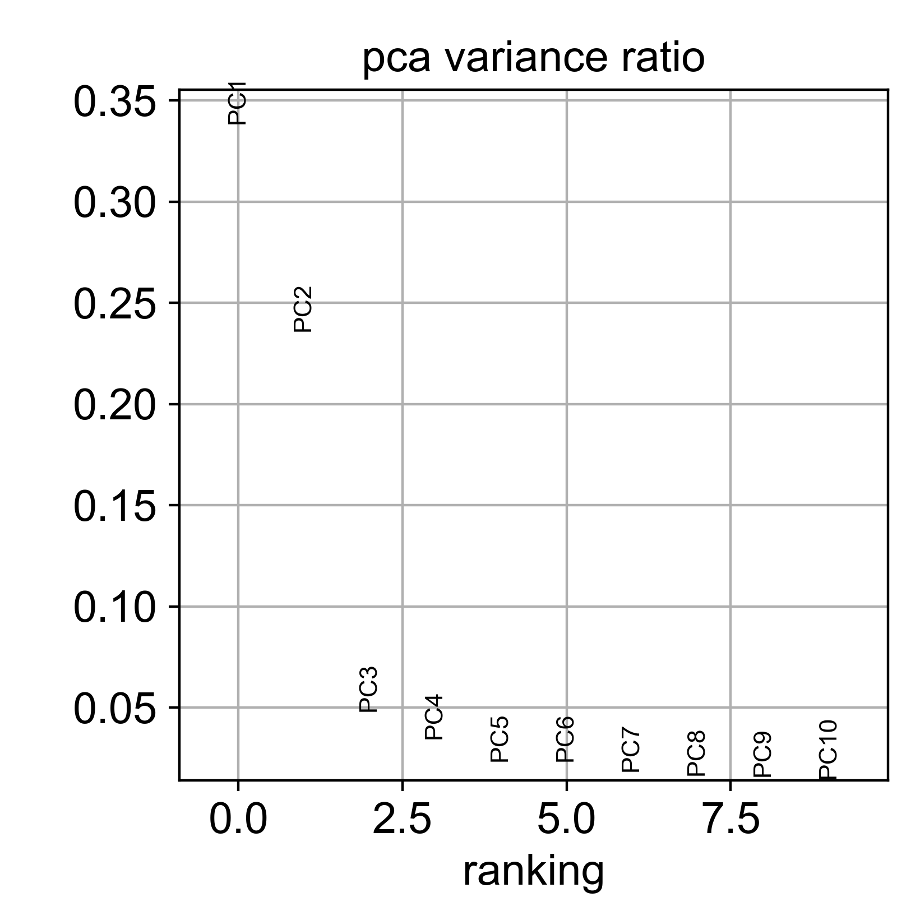
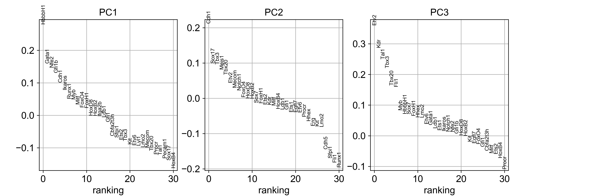
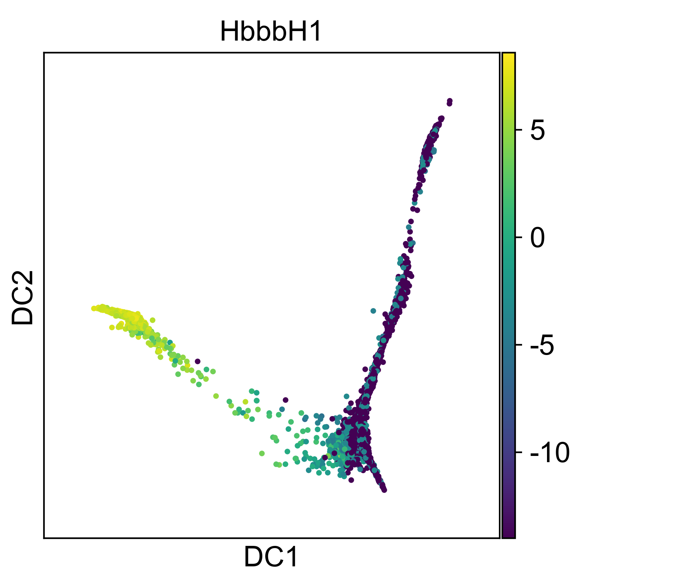
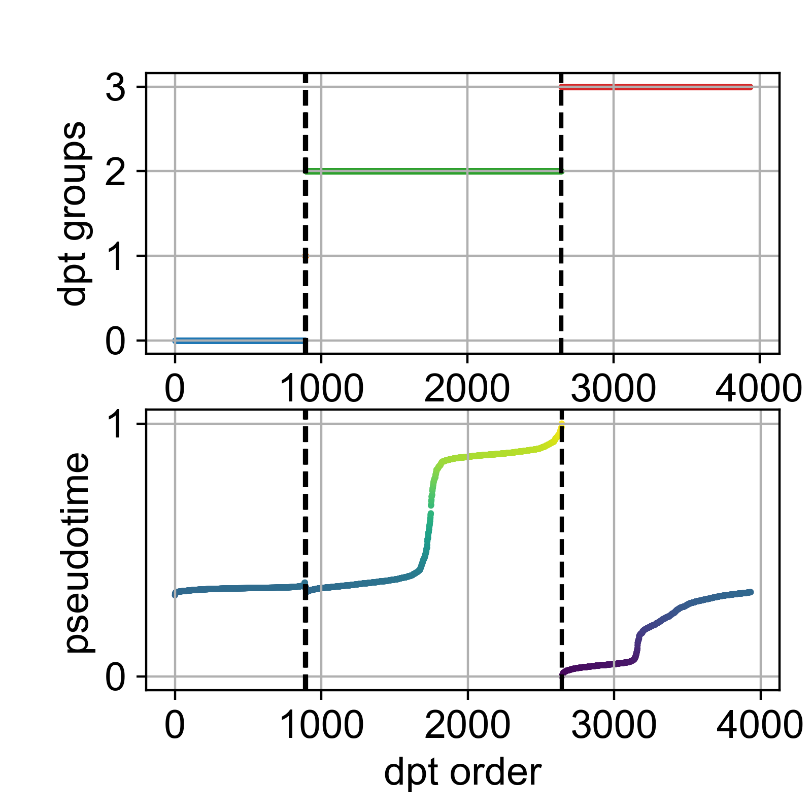
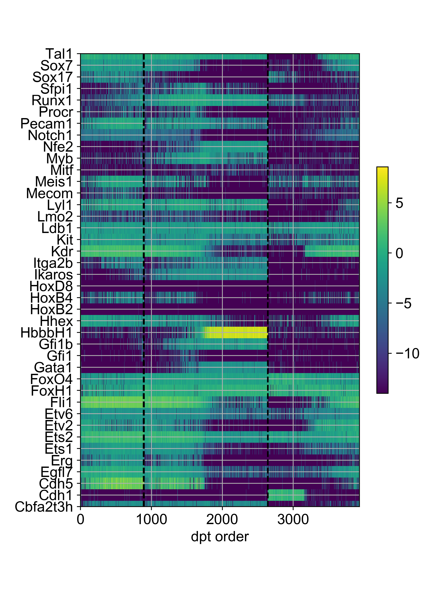

*First compiled: May 3, 2017*   
Also see the [notebook](moignard15.ipynb).

### Differentiation in early mesoderm cells

This reproduces the analysis of [Haghverdi *et al.*,
Nat. Meth. (2016)](http://dx.doi.org/10.1038/nmeth.3971). The data is from
[Moignard *et al.*, Nat. Biotechn. (2015)](http://dx.doi.org/10.1038/nbt.3154).

Here, we provide an analysis using the command line, you can do the same using
Scanpy's API as demonstrated in this [notebook](moignard15.ipynb). As this is a
builtin example, you do not need to create a runfile `runs.py` in your working
directory; this is the [corresponding
part](https://github.com/theislab/scanpy/blob/27d60e2ed40aae3b7ac170e76f41fa2e34ac6040/scanpy/examples/builtin.py#L109-L156)
from the builtin runfile.

Early mesoderm cells in mouse differentiate through three subsequent stages (PS,
NP, HF) and then branch into erythorytes (4SG) and endothelial cells (4SFG).
```
scanpy moignard15 pca -q color=exp_groups
scanpy moignard15 tsne -q color=exp_groups
scanpy moignard15 diffmap -q color=exp_groups
```




Coloring samples/cells by gene expression works analogously,
```
scanpy moignard15 diffmap -q color=HbbbH1
```


Diffusion Pseudotime (DPT) analysis reveals differentation and branching. It
detects the *trunk* of progenitor cells (*dpt group* 0) and the *branches* of
endothelial cells (*dpt group* 1/2) and erythrocytes (*dpt group* 3). The inferred
*pseudotime* traces the degree of cells' progression in the differentiation
process. By default, this is plotted using Diffusion Maps. Using the `-p`
option, you can specify the tSNE basis, for example.
```
scanpy moignard15 dpt -q color=exp_groups legendloc="upper left"
scanpy moignard15 dpt -q color=exp_groups legendloc=none basis=tsne
```


DPT orders cells categorically by *dpt groups*, and within each group, by
pseudotime. Groups are ordered by average pseudotime within the group.  With
this, we reproduced most of Fig. 1 from [Haghverdi *et al.*
(2016)](#ref_haghverdi16).

<!--

Let us rank genes according to differential expression between groups of cells.
```
scanpy moignard15 diffrank -o color=dpt_groups names 0,2,3
```


In contrast to a DPT analysis, a standard clustering in tSNE coordinates blurs
the continuous nature of the data. Also, a seemingly close correspondence
between clusters and experimental groups is *not* confirmed by the top-ranked
genes.
<a id="moignard15_dbscan"></a>
```
scanpy moignard15 dbscan -q color=exp_groups
scanpy moignard15 diffrank -p smp=dbscan_groups names=2,3
scanpy moignard15 diffrank -p smp=exp_groups names names=PS,4SG
```


If you want to use the results externally, read the resulting hdf5
file (inspect its content using `h5ls write/moignard15.h5`). If you prefer
reading and writing csv files, which is much slower, however, use the option
`--fileformat csv`.
-->