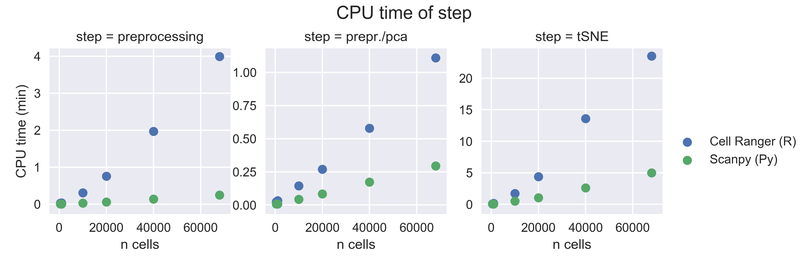
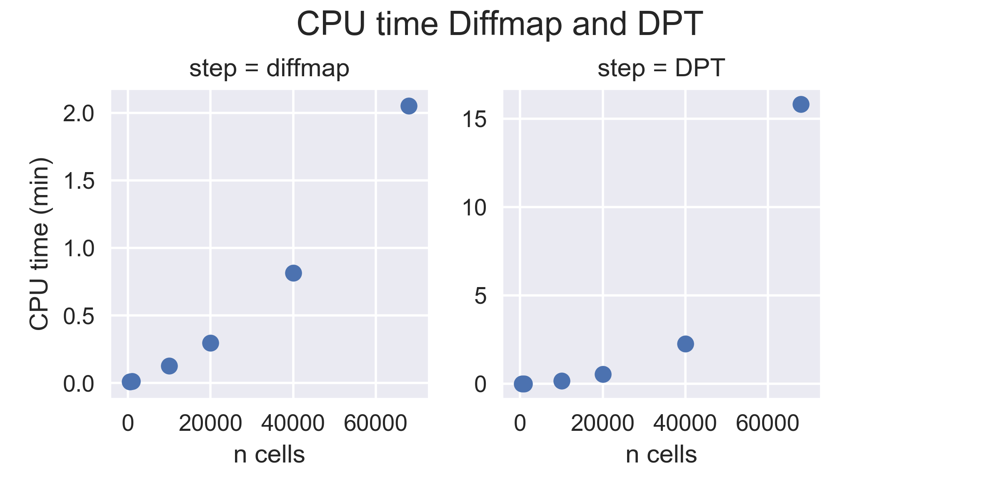
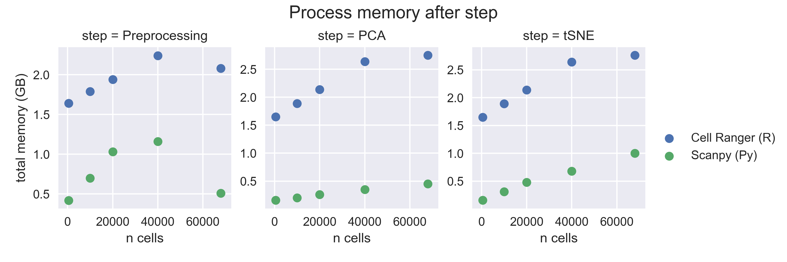
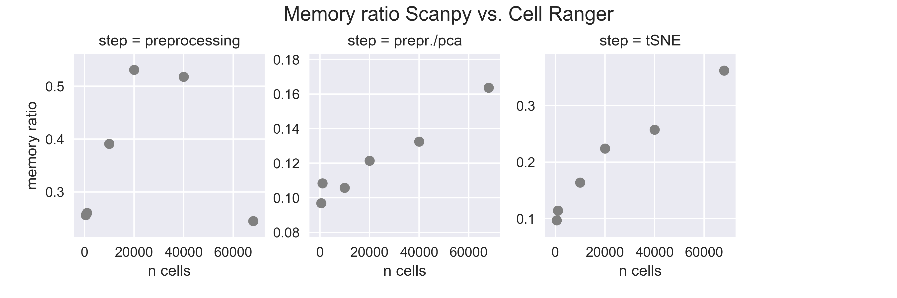

*Compiled: May 3, 2017*

## Scanpy outperforms common R packages

Here, we compare Scanpy with *Seurat* [Macosko *et al.*, Cell](http://dx.doi.org/10.1016/j.cell.2015.05.002) and *Cell Ranger*, the 10x Genomics toolkit [Zheng *et al.*, Nat. Comm. (2017)](https://dx.doi.org/10.1038/ncomms14049). First, we show that Scanpy provides a lot of the functionality of Seurat.

The second comparison focuses on benchmarking, and shows that Scanpy requires much less computational resources than Cell Ranger. In particular, it enables running an analysis of 64000 cells on a small laptop.

### Scanpy and Seurat

Here ([html](seurat_pbmc3k.html)/[notebook](seurat_pbmc3k.ipynb)) we reproduce some of Seurat's [guided clustering tutorial](http://satijalab.org/seurat/pbmc-tutorial.html) as compiled on March 30, 2017. The data consists in 3k PBMCs from a Healthy Donor and is freely available from 10x (here, section Chromium Demonstration (v1 Chemistry) in datasets).

### Scanpy and Cell Ranger

Here, we compare a Scanpy [notebook](zheng17_pbmc64k_cellranger.ipynb) with a [Cell Ranger version of the same notebook](zheng17_pbmc64k_cellranger_r.ipynb). Both notebooks produce profiling information about CPU time and memory usage.

The data used for this consists in 68,579 PBMC cells and is freely available [[page](https://support.10xgenomics.com/single-cell/datasets/fresh_68k_pbmc_donor_a)/[file](https://s3-us-west-2.amazonaws.com/10x.files/samples/cell/fresh_68k_pbmc_donor_a/fresh_68k_pbmc_donor_a_filtered_gene_bc_matrices.tar.gz)].

The comparison shows that Scanpy requires about a factor of 10 less CPU time and less memory in crucial step of the analysis than Cell Ranger. This enables to analyze 64000 cells **without waiting times** interactively on a regular laptop (MacBook Pro 13-inch, Early 2015, one 2,7 GHz Intel Core i5 processor with two cores, 16 GB 1867 MHz DDR3). 

#### Design of the comparison

Both the analysis of 68000 cells with [Scanpy (68000)](zheng17_pbmc64k_cellranger_Py_68000cells.html) and Cell Ranger [Cell Ranger (68000)](zheng17_pbmc64k_cellranger_R_68000cells.html) yield exactly the same results. The notebooks have been split into meaningful steps, in particular *preprocessing*, *further preprocessing/ pca* and *tSNE*. For Scanpy, we also profile *Diffusion Map* and *Diffusion Pseudotime Analysis*.

We also compile the files for lower cell numbers: [Scanpy (40000)](zheng17_pbmc64k_cellranger_Py_40000cells.html), [Scanpy (20000)](zheng17_pbmc64k_cellranger_Py_20000cells.html), [Scanpy (10000)](zheng17_pbmc64k_cellranger_Py_10000cells.html), [Scanpy (5000)](zheng17_pbmc64k_cellranger_Py_5000cells.html), [Scanpy (1000)](zheng17_pbmc64k_cellranger_Py_1000cells.html) and [Scanpy (500)](zheng17_pbmc64k_cellranger_Py_500cells.html) / [Cell Ranger (40000)](zheng17_pbmc64k_cellranger_R_40000cells.html), [Cell Ranger (20000)](zheng17_pbmc64k_cellranger_R_20000cells.html), [Cell Ranger (10000)](zheng17_pbmc64k_cellranger_R_10000cells.html), [Cell Ranger (5000)](zheng17_pbmc64k_cellranger_R_5000cells.html), [Cell Ranger (1000)](zheng17_pbmc64k_cellranger_R_1000cells.html) and [Cell Ranger (500)](zheng17_pbmc64k_cellranger_R_500cells.html).

#### Speedup

We obtain a speed up often around a factor of 10. Particularly in standard preprocessing.

Scanpy offers *Diffusion Maps* and the *Diffusion Pseudotime Analysis* [Haghverdi *et al.*, Nat. Meth. (2016)](http://10.1038/nmeth.3971) for generating cell trajectories that are related to continuous processes as development or dose response. 

#### Memory

The memory measurement here only concerns the memory at the end of a step, it is *not* the maximum memory during a process, where R tends to allocate even a lot more. Still, here, we already observe 10 times less memory use. In practice we observe a clearer memory of efficiency of Scanpy.

