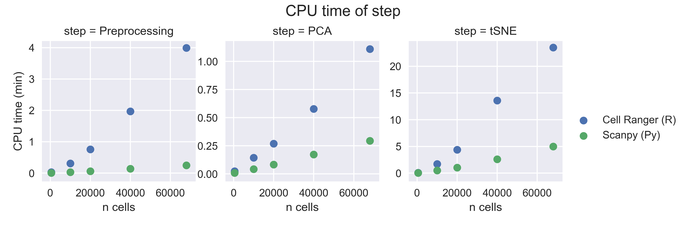
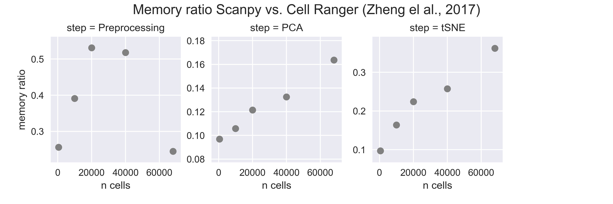

*First compiled: May 3, 2017.*   
See the [notebook](zheng17.ipynb).

## Scanpy computationally outperforms Cell Ranger

Comparing Scanpy with the 10x Genomics *Cell Ranger* R kit ([Zheng *et al.*, Nat. Comms. 2017](https://dx.doi.org/10.1038/ncomms14049)), we find that Scanpy requires 5 to 16 times  less CPU time and less memory in crucial steps of the analysis. This enables analyzing 68000 cells without waiting times interactively on a regular laptop. 

#### Design of the comparison

The analysis has been split into steps *preprocessing*, *PCA* and *tSNE*. For rerunning it, run the [Scanpy](zheng17.ipynb) and [Cell Ranger](zheng17_R.ipynb) notebooks. The archived benchmark runs for 68000 cells can be compared using the [archived Scanpy](http://falexwolf.de/scanpy_usage/170503_zheng17/zheng17_pbmc64k_cellranger_Py_68000cells.html), the [archived Cell Ranger](http://falexwolf.de/scanpy_usage/170503_zheng17/zheng17_pbmc64k_cellranger_R_68000cells.html) notebook and Figure 3j of [Zheng *et al.*, Nat. Comms. (2017)](https://dx.doi.org/10.1038/ncomms14049). Runs were performed on a MacBook Pro 13-inch, Early 2015, one 2,7 GHz Intel Core i5 processor with two cores, 16 GB RAM. All runs are additionally archived ([here](html)).

The [data](https://s3-us-west-2.amazonaws.com/10x.files/samples/cell/fresh_68k_pbmc_donor_a/fresh_68k_pbmc_donor_a_filtered_gene_bc_matrices.tar.gz) used for the comparison consists in 68,579 PBMC cells and is freely available [here](https://support.10xgenomics.com/single-cell/datasets/fresh_68k_pbmc_donor_a).

#### Speedup

We obtain a speedup in the preprocessing routines of a factor 10 to 16, in tSNE and PCA of a factor 3 to 6.

#### Memory

The memory measurement here only concerns the memory at the end of a step, it is *not* the maximum memory during a process, where R tends to allocate even a lot more. Still, here, we observe 10 times less memory used. In practice we observe an even clearer memory efficiency of Scanpy.

