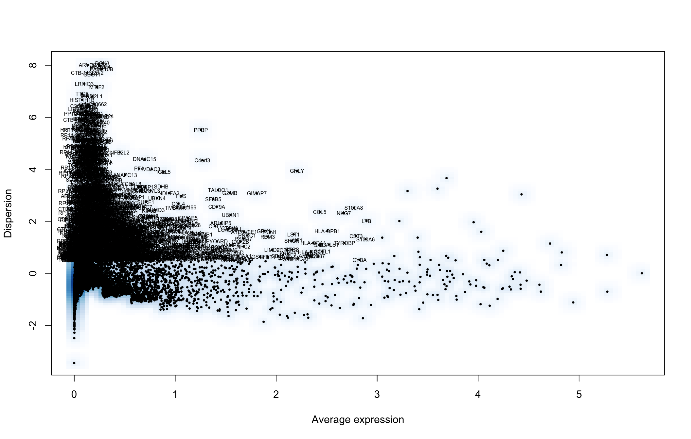
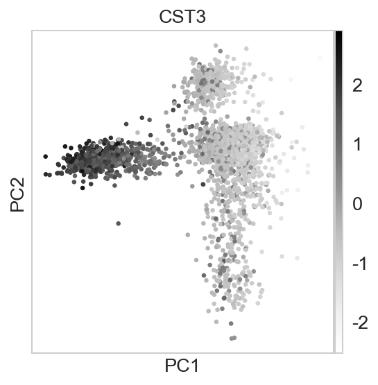
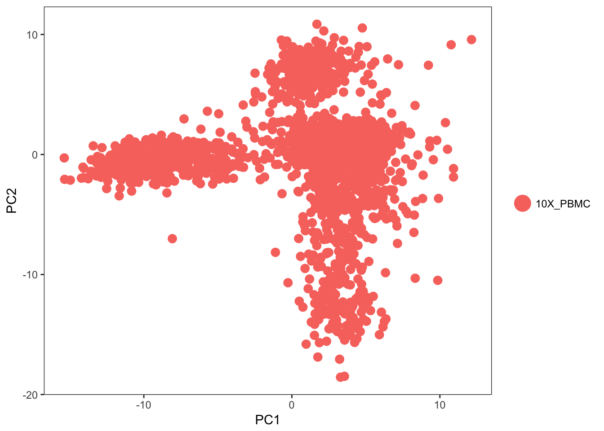
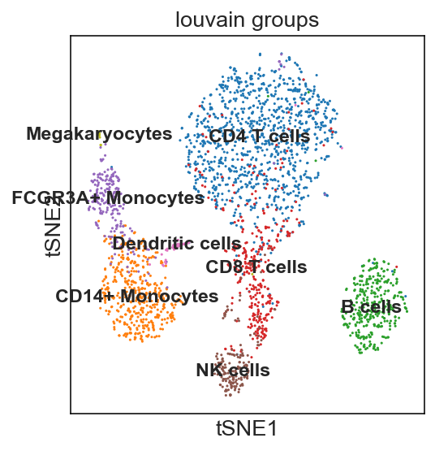
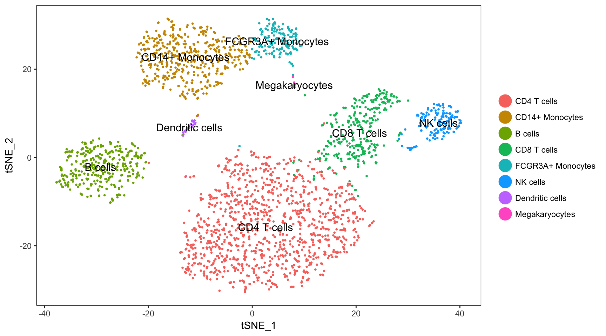
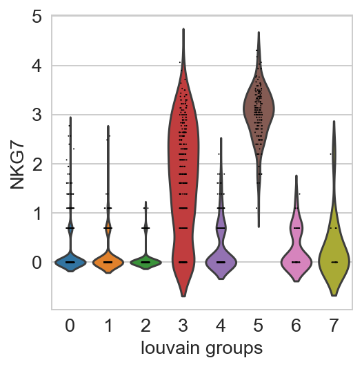
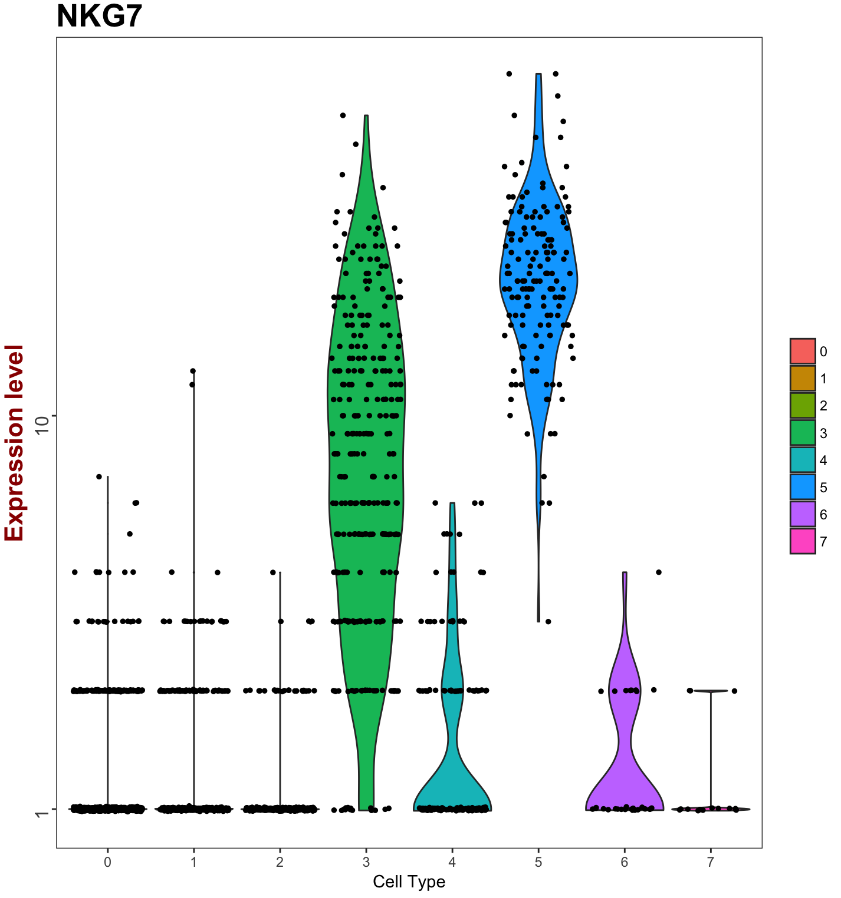
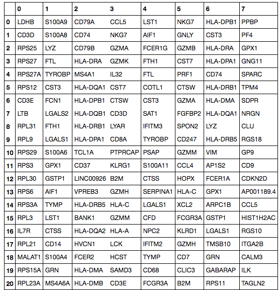
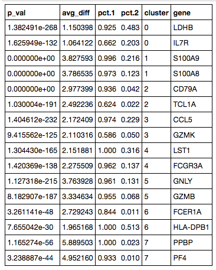

*First compiled: May 5, 2017.*   
See the [notebook](seurat.ipynb).

### Scanpy versus Seurat

Scanpy provides a number of Seurat's features ([Satija *et al.*, Nat. Biotechnol., 2015](https://doi.org/10.1038/nbt.3192)), but at significantly higher computationally efficiency. [Here](seurat.ipynb), we reproduce most of Seurat's [guided clustering tutorial](http://satijalab.org/seurat/pbmc3k_tutorial.html) as compiled on March 30, 2017. The tutorial starts with preprocessing and ends with the identification of cell types through marker genes of clusters. The data consists in *3k PBMCs from a Healthy Donor* and is freely available from 10x ([here](http://cf.10xgenomics.com/samples/cell-exp/1.1.0/pbmc3k/pbmc3k_filtered_gene_bc_matrices.tar.gz) from this [webpage](https://support.10xgenomics.com/single-cell-gene-expression/datasets/1.1.0/pbmc3k)). The profiling information for Seurat has been obtained within [seurat_R.ipynb](seurat_R.ipynb).

| | Scanpy | Seurat |
|----|-----|----|
| **preprocessing** | < 1 s | 14 s |
| **highly variable genes** |  |  |
| **PCA** | < 1 s | 45 s |
|  |  |  |
| **clustering** | 1.3 s | 65 s |
| **tSNE** | 6.5 s | 25 s |
|  |  |  |
| **finding marker genes** | 0.8 s | 96 s |
|  |  |  |
|  |  |  |

