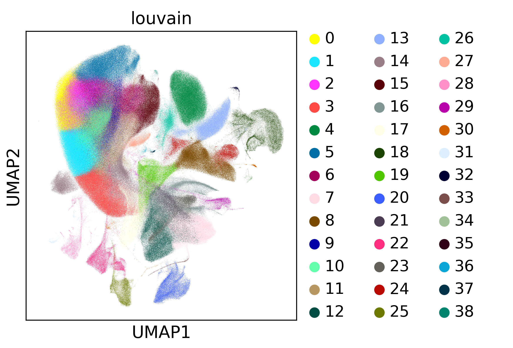

*First compiled: May 22, 2017. Updated: March 28, 2018.*   
Thanks to M. Lotfollahi for running some of these computations!

# Visualizing and Clustering 1.3M neurons

This uses the 1.3M neurons [dataset](https://support.10xgenomics.com/single-cell-gene-expression/datasets/1M_neurons) from 10x Genomics. 

If you have at least 30 GB of memory, run [*cluster.py*](cluster.py) to produce the following result producing in [6 hours](logfile_1.3M.txt) on a small server using at most 2-3 2.4 GHz cores. If you [subsample to 130K](cluster_130K.py) cells, this takes [16 min](logfile_130K.txt). The tSNE computation took about 4 hours using 8 cores.

For simply plotting precomputed results on your laptop, use [*plot.ipynb*](https://nbviewer.jupyter.org/github/theislab/scanpy_usage/blob/master/170522_visualizing_one_million_cells/plot.ipynb), which does not require much memory.

For quick tests, see [*cluster_25K.ipynb*](https://nbviewer.jupyter.org/github/theislab/scanpy_usage/blob/master/170522_visualizing_one_million_cells/cluster_25K.ipynb) for a notebook that processes dataset that has been subsampled to 25K by 10x.

