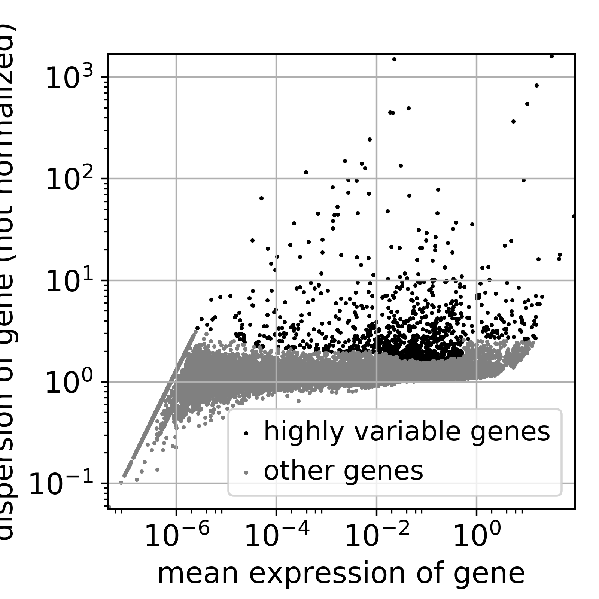
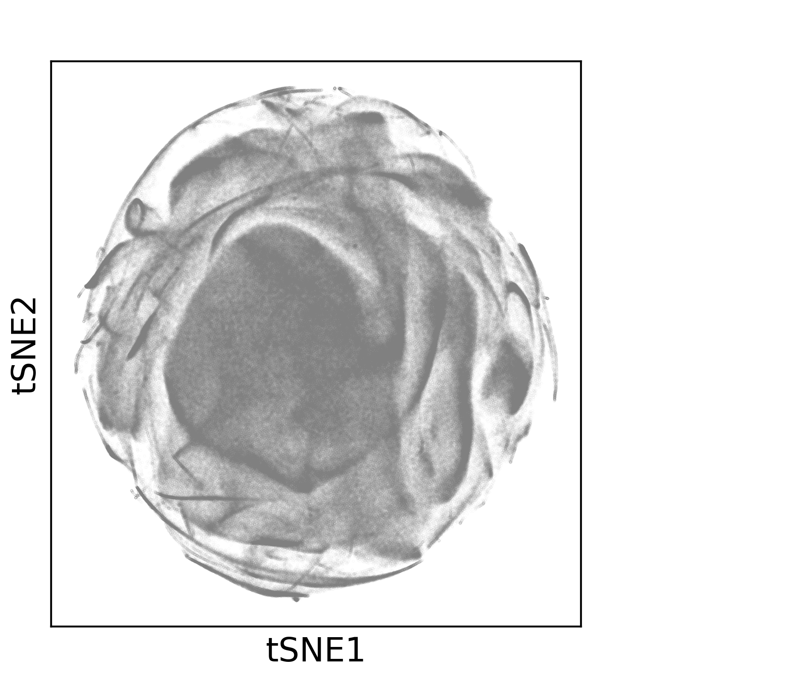
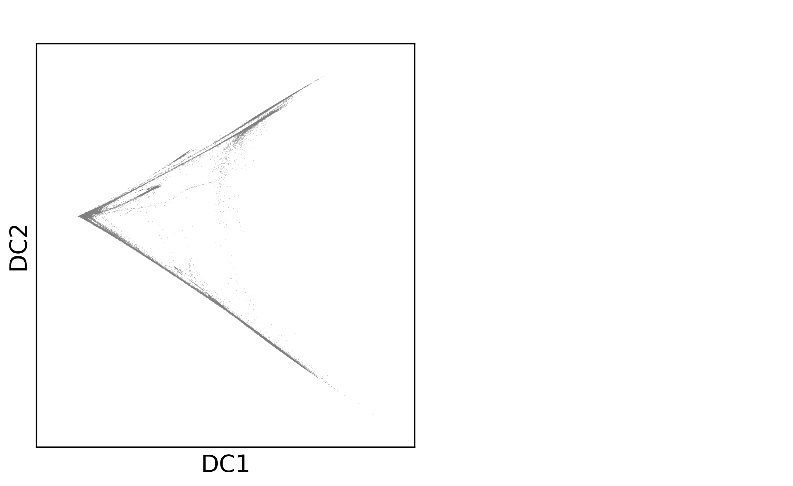
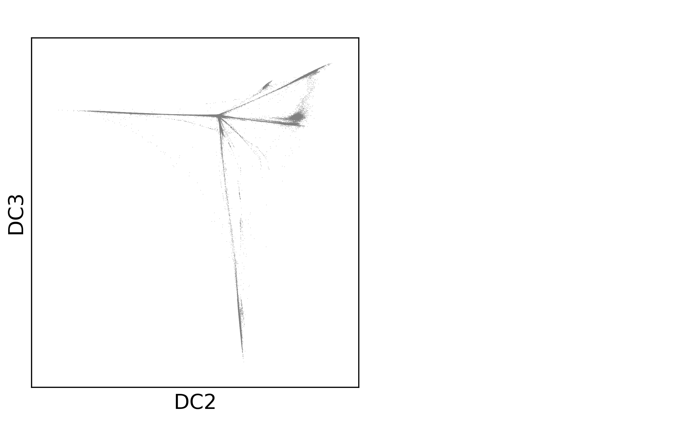

*First compiled: May 22, 2017*

## Visualizing one million cells

This uses the [publicly available](https://support.10xgenomics.com/single-cell-gene-expression/datasets/1M_neurons) 10X 1.3 mio brain cell data set.

### Highly-variable genes

The 1000 most variable genes.



### tSNE

Currently, this runs about four hours. Note the continuous structures.



### Diffusion Map

Currently, this runs about 10 hours. It will be much faster, soon. Note the clear structures, directions of probability flow.




### Code

This has been computed using Scanpy's command-line interface, where the function used to initialize the run was
```
def one_m():
    filename = "path_to_file"
    genome = "mm10"
    adata = sc.read_10x_h5(filename, genome)
    sc.pp.recipe_zheng17(adata)
    sc.pp.pca(adata, n_comps=50, zero_center=False)
    return adata
```
Simply use this in a file `runs.py` in your current working directory and type
```
scanpy one_m tsne
scanpy one_m diffmap
```
on the command line. This directly calls the API functions with the same name. See `scanpy --help` and `scanpy tsne --help` for information on how to change parameters.