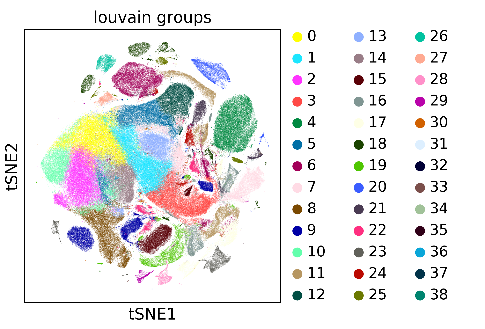

*Updated: February 4, 2018. First compiled: May 22, 2017.*   
Thanks to M. Lotfollahi for rerunning the computations!

## Visualizing and Clustering 1.3M neurons

This uses the 1.3M neurons [dataset](https://support.10xgenomics.com/single-cell-gene-expression/datasets/1M_neurons) from 10x Genomics. 

If you have at least 30 GB of memory, run [*cluster.py*](cluster.py) to produce the following result - this will take much less CPU time in the future:

For simply plotting precomputed results on your laptop, use [*plot.ipynb*](https://nbviewer.jupyter.org/github/theislab/scanpy_usage/blob/master/170522_visualizing_one_million_cells/plot.ipynb), which does not require much memory.

For quick tests, see [*cluster_subsampled.ipynb*](https://nbviewer.jupyter.org/github/theislab/scanpy_usage/blob/master/170522_visualizing_one_million_cells/cluster_subsampled.ipynb) for a notebook that processes the subsampled dataset.

