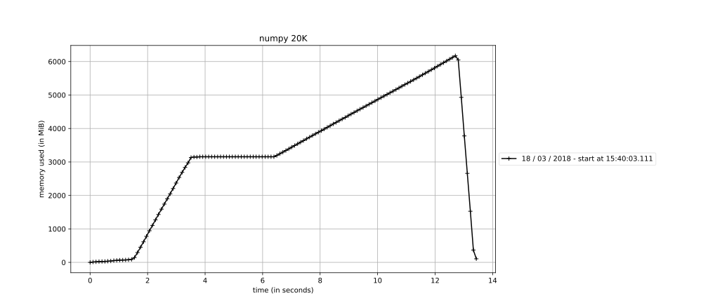
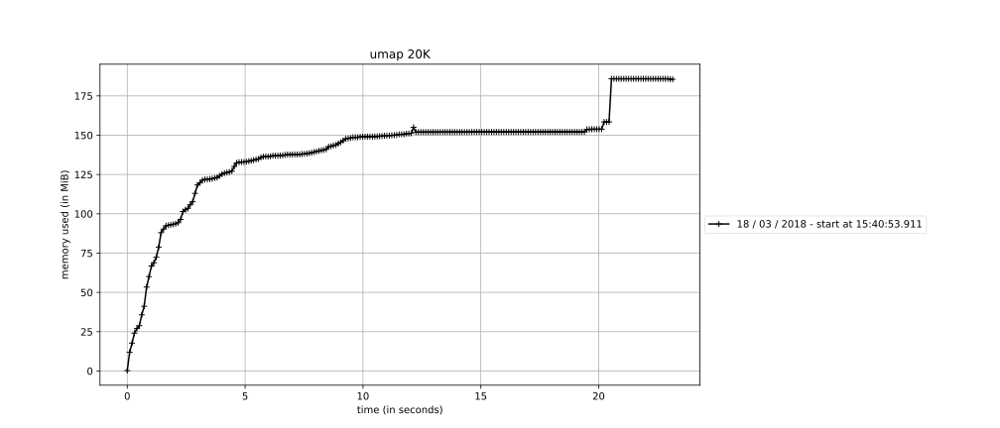
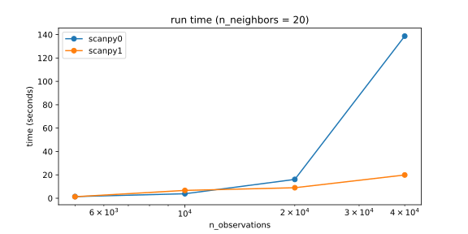

# Benchmarking nearest neighbor computations

In version 0.*, Scanpy's numpy-based neighbor-search used too much memory:

Run [this](memory_over_time.py) to reproduce this figure. Using the approximate nearest neighbor search of UMAP [McInnes & Healy (2018)](https://arxiv.org/abs/1802.03426), this problem is resolved:

By this, also computation times have been much reduced for larger datasets:

which can be produced with this [notebook](neighbors.ipynb).